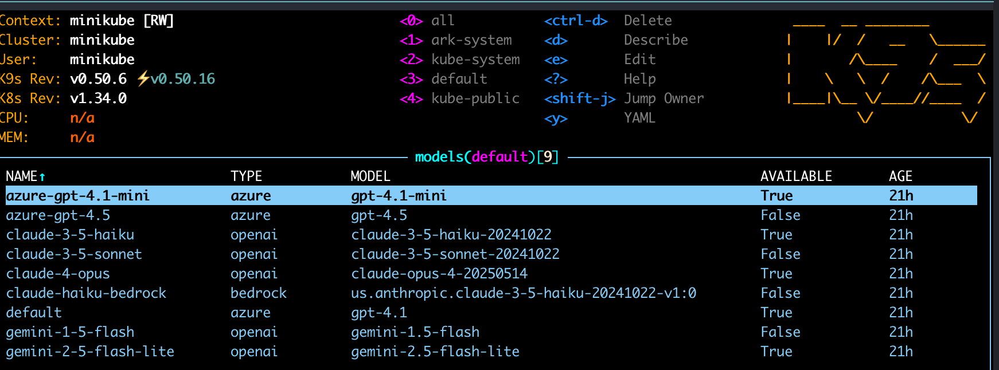

# dwmkerr-ark-demo

A Helm chart for deploying model configurations to [Ark](https://github.com/mckinsey/agents-at-scale-ark) (the Agentic Runtime for Kubernetes) for demo purposes.

This demo kit includes Models, Agents, Agents-as-Tools (sometimes called "Sub-agents"), MCP servers, and also includes Jupyter Notebooks showing different ways to call into Ark.

<!-- vim-markdown-toc GFM -->

- [Quickstart](#quickstart)
- [Resources Created](#resources-created)
    - [Models](#models)
    - [Agents](#agents)
    - [Teams](#teams)
    - [Tools](#tools)
    - [MCP Servers](#mcp-servers)
- [Interactive Notebooks](#interactive-notebooks)

<!-- vim-markdown-toc -->

## Quickstart

Install via Helm:

```bash
helm upgrade --install dwmkerr-starter-kit oci://ghcr.io/dwmkerr/charts/dwmkerr-starter-kit \
    --set models.anthropic.apiKey="your-key" \
    --set models.gemini.apiKey="your-key"
```

Or install locally:

```bash
cp custom-values.template.yaml custom-values.yaml
# Edit custom-values.yaml with your API keys
make install
```

Alternatively, set your API keys as environment variables:

```bash
# Set API keys for the providers you want to enable
export ANTHROPIC_API_KEY="your-anthropic-api-key-here"
export GEMINI_API_KEY="your-gemini-api-key-here" 
export AZURE_OPENAI_API_KEY="your-azure-openai-api-key-here"
export OPENAI_API_KEY="your-openai-api-key-here"
```

The chart automatically enables/disables providers based on which API keys you set as environment variables. You can customize the models and base URLs by editing `custom-values.yaml` if needed.

Default configuration includes:

- Anthropic: Claude models with API key from `ANTHROPIC_API_KEY`
- Gemini: Google Gemini models with API key from `GEMINI_API_KEY`
- Azure OpenAI: GPT models with API key from `AZURE_OPENAI_API_KEY`
- OpenAI: GPT models with API key from `OPENAI_API_KEY`

Each provider is automatically enabled only if its corresponding environment variable is set.

Then use the following commands to deploy the demo kit:

```bash
# Install the starter kit models on Ark
make install

# Uninstall the starter kit from Ark
make uninstall

# Check deployment status
make status
```

A set of models, agents, MCP servers, and tools will be created. Check them with:

```bash
kubectl get models
kubectl get agents
kubectl get mcpservers
kubectl get tools
```

## Resources Created

The following resources are created:

### Models

As long as the appropriate API Keys are provided, models for Azure OpenAI, Gemini, Anthropic and OpenAI providers will be created:



### Agents

The following agents will be deployed:

| Agent Name | Deployed When | Description | Tools |
|------------|---------------|-------------|-------|
| `code-reviewer` | Always | Code review specialist who helps improve code quality, identifies issues, and suggests improvements | None |
| `planner` | Always | Planning specialist who breaks down complex tasks into manageable steps and creates actionable plans | None |
| `team-leader` | Always | Team leader and strategic planner who coordinates work distribution among team members | None |
| `lead-software-engineer` | Always | Lead software engineer with access to development tools, GitHub operations, and best practices | Conditional: GitHub tools, AI Developer Guide tools, shell subagent |
| `github-agent` | `mcpServers.github.enabled` | GitHub specialist for repository management, issues, pull requests, workflows, and security | All GitHub MCP tools |
| `shell-subagent` | `mcpServers.shell.enabled` | Specialized shell operations agent that executes commands safely (used as agent-as-tool) | Shell MCP tool |

### Teams

| Team Name | Strategy | Members | Description |
|-----------|----------|---------|-------------|
| `coding-team` | Sequential | planner, code-reviewer | Collaborative team with planner and code reviewer working sequentially on development tasks |
| `engineering-team` | Selector | planner, lead-software-engineer | Engineering team with planner and lead software engineer using AI-driven participant selection |

### Tools

The following custom tools are created:

| Tool Name | Type | Deployed When | Description |
|-----------|------|---------------|-------------|
| `call-shell-subagent` | agent | `mcpServers.shell.enabled` | Executes shell commands via specialized shell operations agent (agents-as-tools pattern) |

Many tools from each MCP server will also be discovered on startup.

### MCP Servers

MCP servers can be enabled via Helm dependencies in `custom-values.yaml`:

| Name | Values Field | Standalone Install |
|------|-------------|-------------------|
| [shell-mcp](./mcp-servers/shell-mcp/README.md) | `mcpServers.shell.enabled` | `helm install shell-mcp oci://ghcr.io/dwmkerr/charts/shell-mcp` |
| [github-mcp](./mcp-servers/github-mcp/README.md) | `mcpServers.github.enabled` | `helm install github-mcp oci://ghcr.io/dwmkerr/charts/github-mcp --set github.token="your-token"` |
| [AI Developer Guide](https://github.com/dwmkerr/ai-developer-guide) | `mcpServers.aiDeveloperGuide.enabled` | `helm install ai-developer-guide-mcp oci://ghcr.io/dwmkerr/charts/ai-developer-guide-mcp` |

Set to `true` in `custom-values.yaml` and run `make install` (dependencies update automatically).

## Interactive Notebooks

```bash
pip install jupyterlab
```

| Command | Description |
|---------|-------------|
| `python -m jupyterlab notebooks/ark-openai-apis-basic.ipynb` | Simple non-interactive demo showing basic ARK OpenAI API usage |
| `python -m jupyterlab notebooks/ark-openai-apis.ipynb` | Interactive interface with widgets for target selection and streaming modes |
