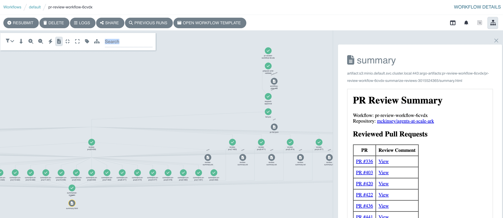
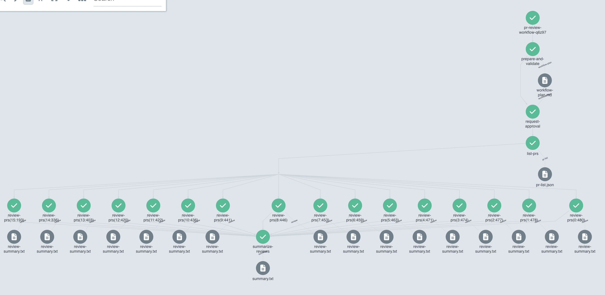
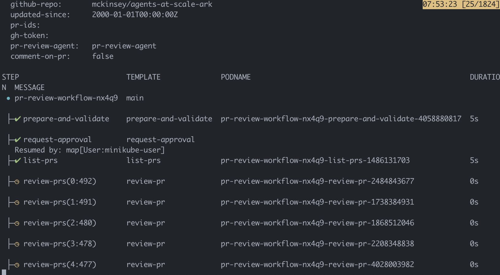
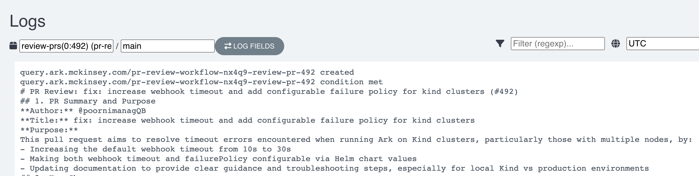
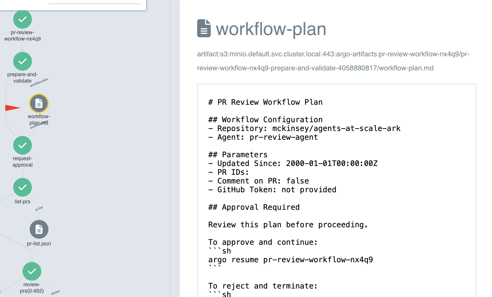
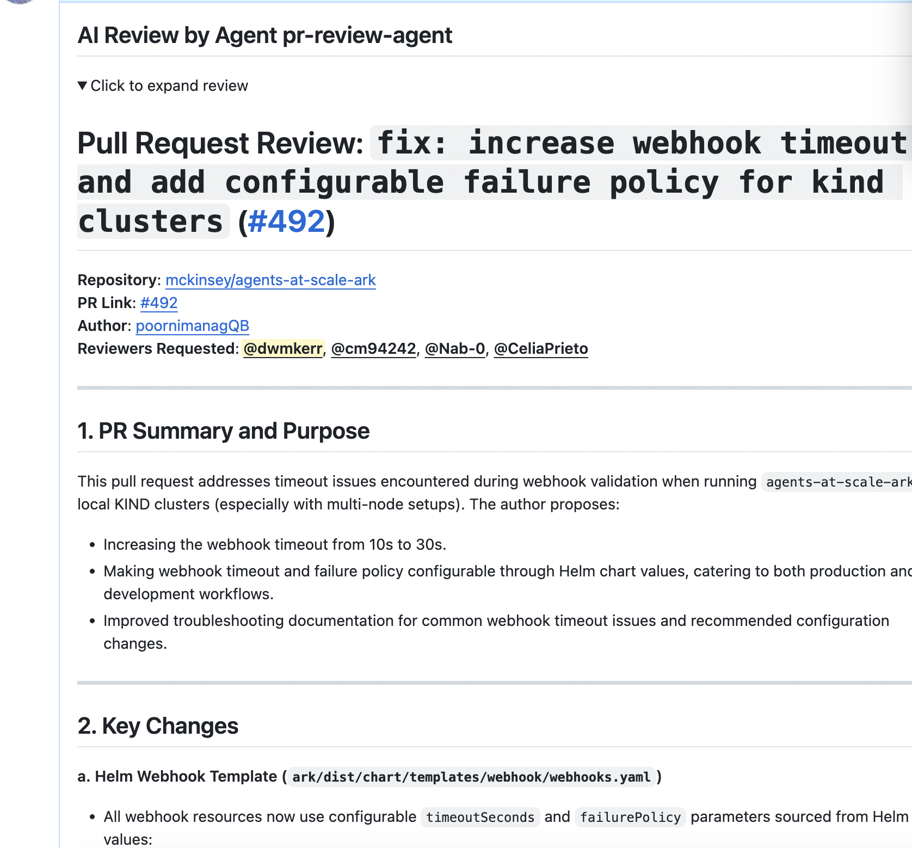
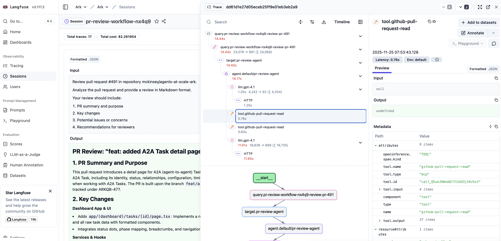
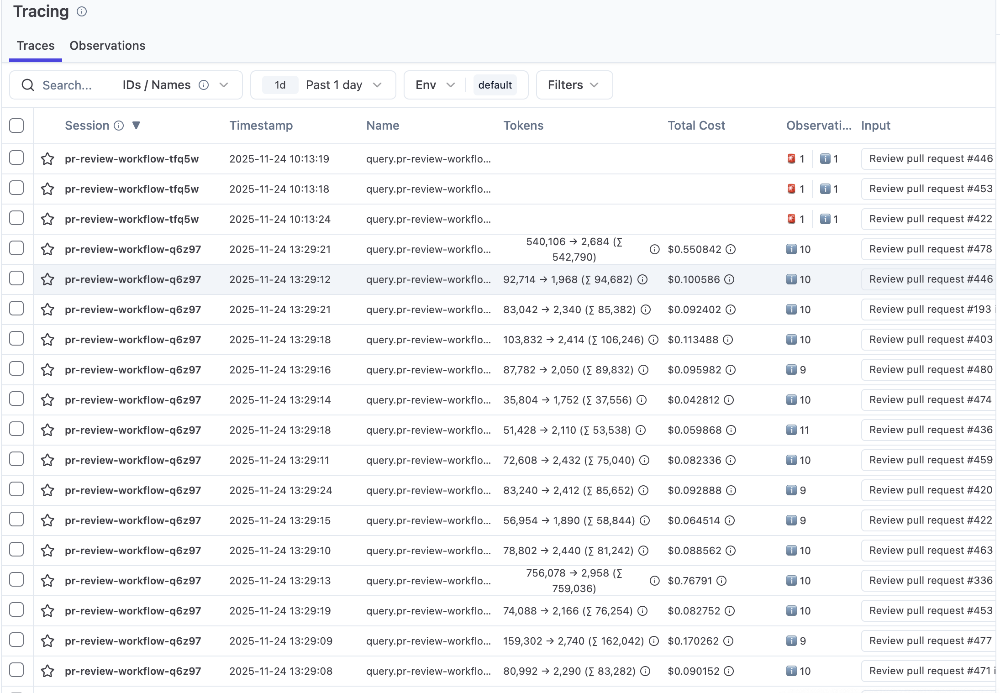
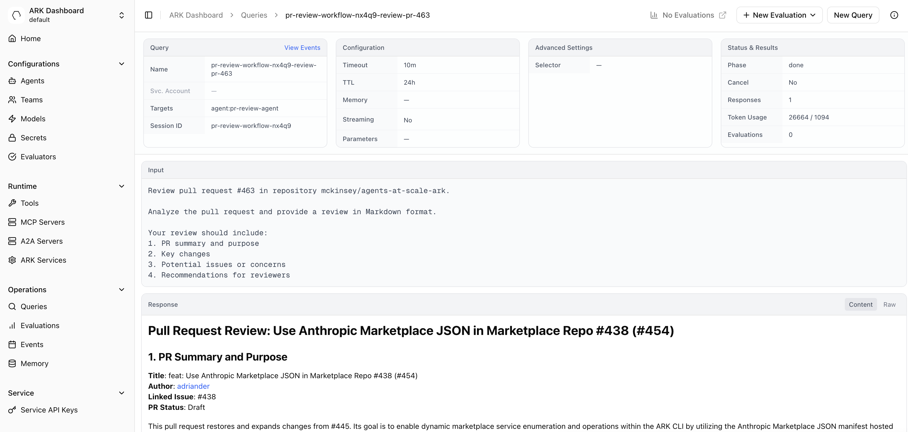
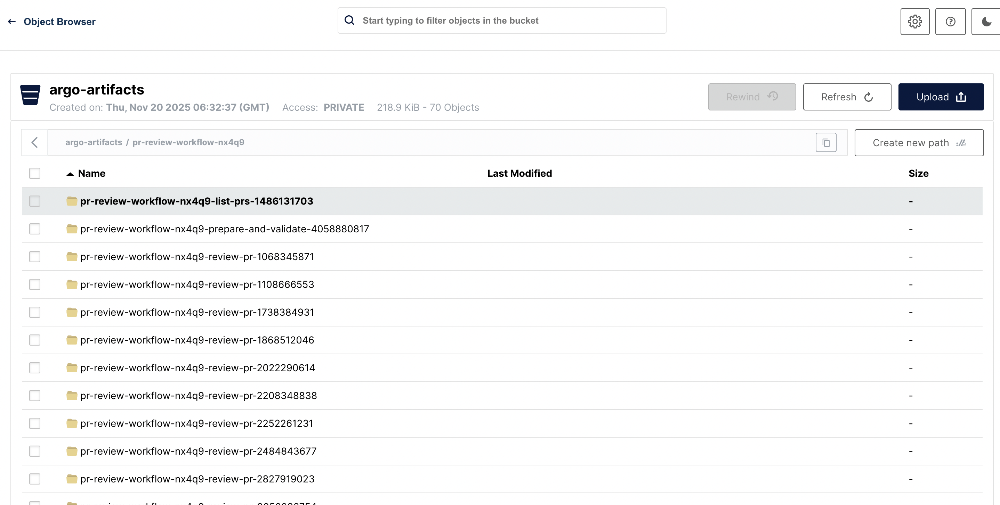

# pr-review-workflow

This workflow orchestrates the pull-request review process against an open source repository.

This demonstrates a combination of agentic and procedural/deterministic operations, along the way highlighting a number of [Ark](https://github.com/mckinsey/agents-at-scale/ark) and Argo capabilities, such as: validation of configuration, risk-management for credentials, running workflow steps in isolated and customised containers, human-in-the-loop approval, recording of actions for audit/forensics, procedural/deterministic operations, fan-out of work across multiple parallel steps, agentic operations, agentic attribution or 'breadcrumbs', session management and telemetry across complex processes and more.



<!-- vim-markdown-toc GFM -->

- [Overview](#overview)
- [Installation](#installation)
- [Running the Workflow](#running-the-workflow)
- [Inspecting Outputs, Artifacts and Telemetry](#inspecting-outputs-artifacts-and-telemetry)
- [Cleanup](#cleanup)
- [TODO](#todo)

<!-- vim-markdown-toc -->

## Overview

The workflow performs the following actions:

**Preparation, Validation and PR Discovery**

The first step validates that the required resources and capabilities are installed, such as agents, models and MCP servers. If a GitHub token is provided, the workflow validates it and displays the authenticated user and scopes in the workflow plan. Fine-grained tokens don't expose scopes via the API, so a warning is shown in this case. The step then fetches the list of open pull requests (optionally filtered by label) and generates a workflow plan showing which PRs will be reviewed.

**Approval**

The workflow pauses for approval, displaying the PRs to be reviewed. This allows operators to verify scope before proceeding.

**Agentic Review of Pull Requests against Configurable Standards**

An agent reviews each pull request against configurable standards via MCP. Failed reviews are automatically retried with exponential backoff to handle rate limits.

**Optional Commentary on Pull Requests, with Attribution**

In this optional step, the review of the pull request is added as  comment.

**Final Summarisation and Report with optional Cleanup**

A final summarisation of all steps is made, with a final report saved to long-term storage. A table is shown with a link to each pull request and the review comment.

## Installation

First, ensure that [Ark](http://github.com/mckinsey/agents-at-scale-ark) is installed. Run the commands below, or follow the [Ark Quickstart Guide](https://mckinsey.github.io/agents-at-scale-ark/quickstart/):

```bash
# Install the Ark CLI (Node.JS and NPM required).
npm install -g @agents-at-scale/ark

# Install Ark. Wait for up to 5m for ark to be ready.
ark install
ark status --wait-for-ready=5m

# Use the dashboard to configure a default model (or check the docs).
ark dashboard
```

You must have a default model configured, run `ark dashboard` and follow the instructions, or check [the docs](https://mckinsey.github.io/agents-at-scale-ark/quickstart/).

Now install [Argo Workflows for Ark](https://mckinsey.github.io/agents-at-scale-ark/developer-guide/workflows/argo-workflows), along with [Minio as an Artifact Repository](https://argo-workflows.readthedocs.io/en/latest/configure-artifact-repository/#configuring-minio) for artifact storage. Note that at a later date Argo will be optionally installed as part of the main Ark installation and this step will not be required:

```bash
# First install Minio, which will be used for file storage.
helm upgrade minio-operator operator \
  --install \
  --repo https://operator.min.io \
  --namespace minio-operator \
  --create-namespace \
  --version 7.1.1

# Now install Argo workflows, with minio enabled.
helm upgrade argo-workflows \
  oci://ghcr.io/mckinsey/agents-at-scale-ark/charts/argo-workflows \
  --install \
  --set minio.enabled=true

# These services can take a while to install, check the status with:
kubectl get tenant                                           # will show 'green'
kubectl get pods -n minio-operator                           # will show 'ready'
kubectl get pods -l app.kubernetes.io/part-of=argo-workflows # will show 'ready'
```

You can now check the Argo Workflows dashboard as well as the Minio dashboard:

```bash
# Show the Argo Workflows dashboard:
kubectl port-forward svc/argo-workflows-server 2746:2746
# http://localhost:2746

# Show the minio dashboard:
kubectl port-forward svc/myminio-console 9443:9443
# https://localhost:9443
# Username: minio
# Password: minio123
```

Optionally install a telemetry service such as [Langfuse](https://mckinsey.github.io/agents-at-scale-marketplace/services/langfuse/) or [Phoenix](https://mckinsey.github.io/agents-at-scale-marketplace/services/phoenix/). As an example for Langfuse:

```bash
# Install langfuse, wait for it to be ready (this can take 5-10 mins), then open
# the dashboard.
ark install marketplace/services/langfuse
kubectl wait --for=condition=Available -n telemetry deployment/langfuse-web
kubectl port-forward -n telemetry services/langfuse-web 3000:3000
# https://localhost:3000
# Username: password123
```

Install the Pull Request Review workflow, as well as the GitHub MCP server which it depends upon:

```bash
# Install the GitHub MCP server with your GitHub token.
helm upgrade --install github-mcp oci://ghcr.io/dwmkerr/charts/github-mcp \
  --set github.token=${GITHUB_TOKEN}

# Install the Pull Request Review workflow.
kubectl apply -f https://raw.githubusercontent.com/dwmkerr/ark-demo/refs/heads/main/demos/pr-review-workflow/pr-review-workflow.yaml
```

## Running the Workflow

Open the Argo Dashboard (http://localhost:2746) and submit the workflow, watch the status and click on the 'Approval' step and then approve/reject as needed. The workflow will run and all open pull requests will be reviewed:



The workflow can also be run using the `argo` CLI:

```bash
argo submit --from workflowtemplate/pr-review-workflow \
    -p github-repo=mckinsey/agents-at-scale-ark \
    --watch
# When needed, run 'argo resume <workflow_name>'
```



## Inspecting Outputs, Artifacts and Telemetry

By clicking on any node in the workflow and checking "Summary > Logs" the output of each step can be seen:



Any artifact can be selected to view the file contents:



If the option to add a comment to the pull request was set, the pull request will be updated:



If a telemetry provider has been configured, all queries, tool calls, HTTP calls, token usage etc can be analysed. In the screenshot below Langfuse has been configured as a telemetry provider (see the [Agents at Scale Marketplace](https://github.com/mckinsey/agents-at-scale-marketplace) for instructions on how to do setup Langfuse, Phoenix, etc):





Of course, all queries and agents and associated Ark resources can also be accessed via the Ark dashboard:



Finally, if an artifact storage provider has been configured, then artifacts will be available to view in their backend. In this example, Minio has been used as a storage backend and the workflow artifacts are shown:



Any S3 API compatible storage backend can be used.

## Cleanup

The [`cleanup-pr-review`](./cleanup-pr-review.yaml) workflow can be used to clean up comments generated by the PR review process.

## TODO

- [ ] put the query into its own yaml and expand it as a template
- [ ] create plan is the step name
