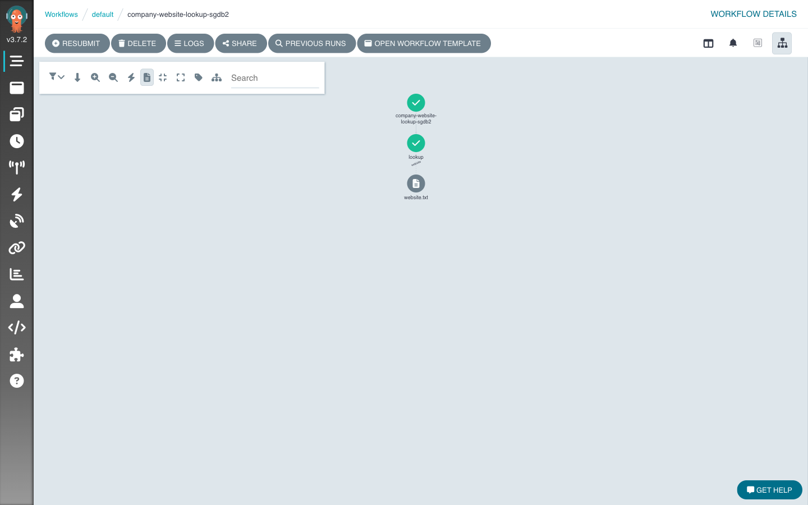
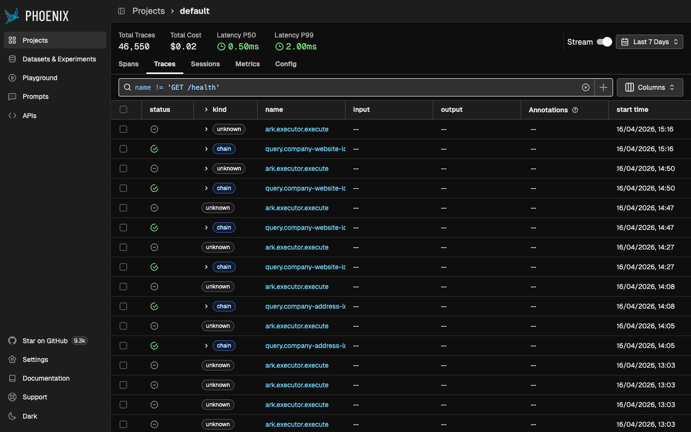
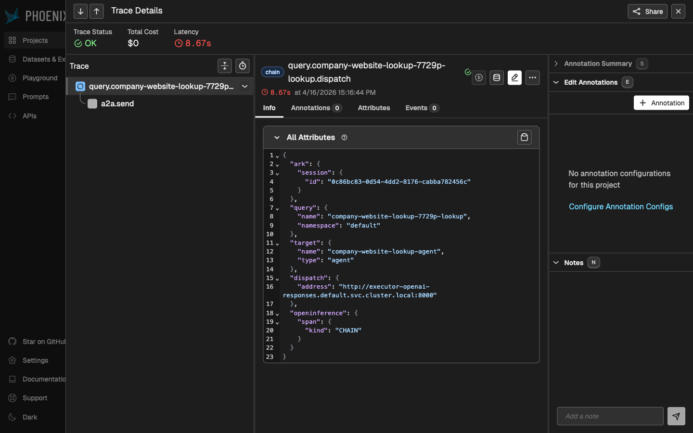

# responses-tool-calling

Minimal demo of an [OpenAI Responses](https://github.com/mckinsey/agents-at-scale-marketplace/tree/main/executors/openai-responses) agent with the built-in `web_search_preview` tool, driven by a single-step Argo workflow that takes a company name and returns its official website URL.

Everything interesting is in the embedded shell block of `company-website-lookup.yaml`: it creates an Ark `Query` against the agent, waits for completion, and pulls the URL out of `.status.response.content`. Telemetry (tool calls, token usage, spans) is captured in Phoenix — the executor chart picks up the `otel-environment-variables` Secret that the Phoenix marketplace service creates in `default`, so no extra wiring is needed.





## Prerequisites

Depends on the `gpt-5-4` Model and the `executor-openai-responses` ExecutionEngine — both come from `make install`. See the [repo root README](../../README.md) if Ark isn't set up.

## Install Argo Workflows + Minio

Argo isn't part of the default Ark install yet. Install it with Minio as the artifact store:

```bash
# Minio operator (for artifact storage).
helm upgrade minio-operator operator \
  --install \
  --repo https://operator.min.io \
  --namespace minio-operator \
  --create-namespace \
  --version 7.1.1

# Argo Workflows with Minio enabled.
helm upgrade argo-workflows \
  oci://ghcr.io/mckinsey/agents-at-scale-ark/charts/argo-workflows \
  --install \
  --set minio.enabled=true

# Wait for things to come up.
kubectl get tenant                                           # expect 'green'
kubectl get pods -n minio-operator                           # expect 'ready'
kubectl get pods -l app.kubernetes.io/part-of=argo-workflows # expect 'ready'
```

## Install Phoenix (if not already via `make install`)

```bash
ark install marketplace/services/phoenix
kubectl wait --for=condition=Available -n phoenix deployment/phoenix --timeout=5m
```

The Phoenix marketplace service creates the `otel-environment-variables` Secret in `default` (with `OTEL_EXPORTER_OTLP_ENDPOINT=http://phoenix-svc.phoenix.svc.cluster.local:6006`). The `executor-openai-responses` chart references it via `envFrom: secretRef` (optional), so install order is: Phoenix first, then executor — and traces flow automatically.

If Phoenix was installed *after* the executors (e.g. the order in this repo's `make install`), restart the executor pods so they pick up the Secret, and enable the OpenAI-layer instrumentor so spans contain prompt/response/tool/token attributes — otherwise the OpenAI span in Phoenix shows `{}`. Tracks marketplace issue [#233](https://github.com/mckinsey/agents-at-scale-marketplace/issues/233).

```bash
kubectl set env deploy/executor-openai-responses OTEL_INSTRUMENTATION_ENABLED=true
kubectl rollout restart deploy/executor-claude-agent-sdk
```

## Apply + run

```bash
# Check deps are set; otherwise `make install` and follow main instructions.
kubectl get model gpt-5-4 executionengine/executor-openai-responses

kubectl apply -f company-website-lookup.yaml

argo submit --from workflowtemplate/company-website-lookup \
    -p company-name="ADAM GROOMING BN LTD" \
    --watch
```

## Open the dashboards

```bash
# (Kill first if needed)
killport 2746
killport 6006
killport 9090

# Argo (to see the workflow and artifacts).
# Phoenix (to see the agent trace, tool call, token usage).
# Minio (to see the artifact bucket, optional).
kubectl port-forward svc/argo-workflows-server 2746:2746 &
kubectl port-forward -n phoenix svc/phoenix-svc 6006:6006 &
kubectl port-forward svc/myminio-console 9090:9090 &

# Open the dashboards.
open http://localhost:2746
open http://localhost:6006
open http://localhost:9090  (minio / minio123)
```

## Cleanup

```bash
kubectl delete -f company-website-lookup.yaml
kubectl delete queries -l workflow
```
